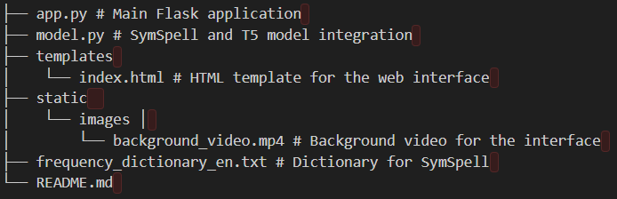

# Autocorrect Tool Using AI and ML

An AI-powered autocorrect tool designed to improve text accuracy by performing spelling and grammar corrections. This tool leverages the SymSpell algorithm for efficient spelling corrections and a pre-trained `t5-small` model from Hugging Face for advanced grammar corrections. The user-friendly interface is built with Flask and Bootstrap.

---

## Features
- **Spelling Correction**: Utilizes the SymSpell library to identify and correct spelling errors in text.
- **Grammar Correction**: Employs the `t5-small` transformer model to fix grammatical mistakes.
- **File Upload Support**: Allows users to upload text files for bulk corrections.
- **Interactive Interface**: A simple and elegant web interface built using Flask and Bootstrap.
- **Copy to Clipboard**: Users can easily copy corrected text with a single click.

---

## Project Structure




---

## Installation

### Prerequisites
- Python 3.8 or higher
- `pip` for Python package management

### Steps
1. Clone the repository:
   ```bash
   git clone https://github.com/yourusername/autocorrect-tool.git
   cd autocorrect-tool
Install dependencies:

2. Install dependencies:
    ```bash
    pip install -r requirements.txt
    Download frequency_dictionary_en.txt:

3. Download the file from SymSpell GitHub.
    Place it in the project root directory.

4. Run the Flask app:
    ```bash
    python app.py
    
5. Open your browser and go to:
    ```bash
    http://127.0.0.1:5000/

### Usage

1. Text Input
    Enter text into the text box on the homepage.
    Click the "Correct" button to see spelling and grammar corrections.

2. File Upload
    * Upload a .txt file for bulk corrections.
    * View the corrected file text and grammar results on the webpage.

3. Tools and Technologies
    * Backend: Flask, SymSpell, Hugging Face Transformers
    * Frontend: HTML, CSS, Bootstrap
    * Language Model: t5-small
    * Spelling Correction: SymSpell
    * Deployment: Localhost (development)


### Known Issues
    1. The t5-small model may struggle with very complex grammar corrections.
    2. SymSpell requires a comprehensive dictionary file for effective spelling corrections.

### Author
    
    Developed by SUHAS B M. Feel free to reach out at suhasbm2004@gmail.com 